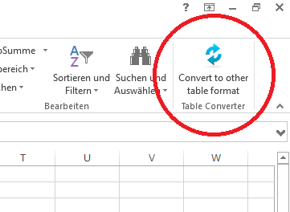

# Excel Table Converter #

   

The Excel Table Converter lets you easily convert selected parts of an excel table into other formats. The currently supported target table formats are:

* LaTeX tables
* Atlassian Jira tables
* Markdown tables

## How to use ##

The Excel Table Converter is a Microsoft Excel Add-In. After installation, a new button *Convert to other table format* becomes available in the *Start* ribbon tab.

To use the Excel Table Converter, first **select a range of cells** which you would like to convert, then click the *Convert to other table format* button. A dialog will be opened which shows some configuration dependent on the selected output format.

You can either save the output to a file or copy it directly to the clipboard. The output for the above setting would look like this:

    \begin{table}
    \centering
    \begin{tabular}{|l|l|l|}

    a & b & c \\
    d & e & f \\

    \end{tabular}
    \caption{Example Table}
    \end{table}

### Quick Convert ###

The Excel Table Converter adds a new entry to the context menu called *Quick Convert*. Clicking this entry **copies the converted target table to to the clipboard.** *Quick Convert* uses the current settings from the Convert dialog.

### General target table features ###

All target table formats support emphasizing the target cells based on the settings in the Excel cells. **Bold cells** will also be formatted **bold** in the target format and *italic cells* will also be formatted *italic*.

### LaTeX target table format ###

The LaTeX output format is the most mature target table format and offers a wide range of settings.
Supported features for the LaTeX output format are:

- Set text- and fill-color of LaTeX table cells based on colors in the Excel cells
- Automatically justify the cells based on the data type when no explicit justification is specified (e.g. numbers are automatically justified right).
- The LaTeX table converter also provides some options for handling borders. The most advanced feature supports reading the border from the Excel file and applies these settings to the LaTeX output. Supported border styles are solid, dashed, dotted and double-line solid.
- Check if the LaTeX `table` environment should be created.
- Set the table name. This value will be used as caption for the LaTeX table. If not set, the name of the Excel sheet will be used.
- Check if special LaTeX characters should be replaced by the corresponding escape symbols (e.g. `%` will be replaced by `\%`).

### Atlassian Jira table format ###

- The single extended Atlassian Jira feature for now is to define if the first row should be treated as a header row or not. A header row gets differently formatted by Jira. 

### Markdown table format ###

- For now the markdown table format does not provide any extended features.

## Installation ##

You have two possibilities to get the Excel Table Converter:

- Fork, clone or download the source code and build using Visual Studio 2013 or higher. Then start the program from Visual Studio directly or run the `ExcelTableConverter.AddIn.vsto` which is located in the `Bin` folder after build.
- Get the binaries from the [releases page](https://github.com/meinsiedler/ExcelTableConverter/releases). Extract the ZIP-file and execute the `setup.exe` to install the Excel Add-In. The binaries will regularly be updated for new releases.

## License ##

Excel Table Converter is released under the [MIT License](http://opensource.org/licenses/MIT).
